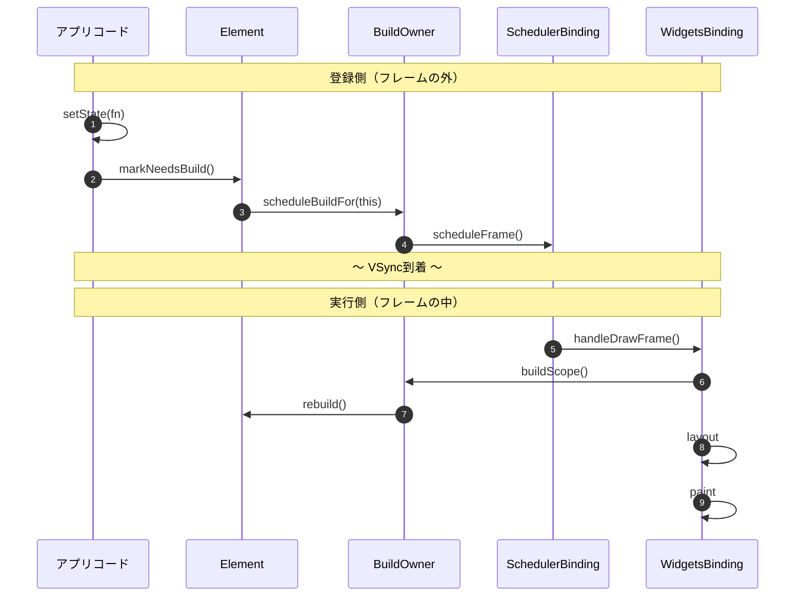

# Ch3: 再構築スケジューリング

## 章の中心的な問い

**setStateを呼んだとき、buildはいつ・誰によって実行されるのか？**

---

## 前提：setStateからbuildまでの間に何が行われているのか

setStateを呼ぶとUIが更新されるが、setStateがbuildを直接呼んでいるわけではない。間にフレームという単位と、3つの責務がある。この章の検証シナリオを読む前に、まずこの構造を押さえておく。

### フレーム：画面を1回書き換える単位

スマホの画面は動画と同じ原理で、静止画を高速に描き替えることで動きを表現している。1秒間に60回（60fps）や120回（120fps）、画面全体を描き直す。この**1回の描き直し**が1フレームとなる。

```
時間 →
│ フレーム1 │ フレーム2 │ フレーム3 │ フレーム4 │
│  16.7ms  │  16.7ms  │  16.7ms │  16.7ms  │
                                     ↑
                                    60fpsなら1フレーム≒16.7ms
```

ディスプレイのハードウェアが「次の描き直しの準備ができました」と通知する信号でVSyncというものがある。フレームの開始はVSync信号によって決まるため、アプリコード側からbuildの実行タイミングを制御することはできない。アプリコード側からできるのは、setStateを通じて「このElementは再構築が必要」というフラグ（dirty）をElementに付け、次のフレームでのrebuildを予約することだけとなる。

1フレームの中では、build（Widgetの再生成）→ layout（サイズと位置の計算）→ paint（ピクセルの描画）のまとまりで実行される。

### なぜ「登録」と「実行」が分かれるのか

仮にsetStateから直接buildを呼ぶとしたら、毎回buildからpaintまでを行うことになる。

```
仮にsetStateが直接buildを呼ぶ場合：
  setState #1 → build → layout → paint  ← 画面描き直し
  setState #2 → build → layout → paint  ← もう一度描き直し
  setState #3 → build → layout → paint  ← さらにもう一度

  → 1タップで画面を3回描き直すので無駄が多い
```

build・layout・paintはコストの高い処理なので、実行回数を減らしたい。なのでsetStateの時点では「このElementを再構築してほしい」という登録までにとどめて、フレーム単位でまとめてbuild・layout・paintを行うことで実行回数を減らしている。

```
実際のFlutterの設計：
  setState #1 → dirty登録（markNeedsBuild）
  setState #2 → 無視（すでにdirty）
  setState #3 → 無視（すでにdirty）

  ～ VSync ～

  build → layout → paint  ← 画面描き直しは1回のみ（handleDrawFrame）
```

この「登録」と「実行」の分離を、3つの責務が連携して実現している。

### 3つの責務

```
SchedulerBinding  … フレームの「いつ」を管理する（時間）
BuildOwner        … 「何を」rebuildするか管理する（対象）
WidgetsBinding    … フレーム内で「どの順で」処理を進めるか管理する（進行）
```

**SchedulerBinding：** VSyncの信号を受け取り、フレーム処理を起動する。BuildOwnerから「次のフレームが必要です」というリクエスト（`scheduleFrame()`）を受け付け、次のVSyncで`handleDrawFrame()`を起動する。フレームの中身（何をbuildするか、どの順で処理するか）には関知しない。

**BuildOwner：** 「登録」と「実行」の両方を担う。登録側では`scheduleBuildFor()`でdirty Elementをリストに収集する。実行側では`buildScope()`でdirtyリストをdepth順にソートし、各Elementの`rebuild()`を実行する。重複排除（同じElementが複数回登録されても1回しかrebuildしない）もここが担う。

**WidgetsBinding：** フレーム内でbuild → layout → paint → finalizeTreeの順序を管理する進行役。`drawFrame()`の中でBuildOwnerにbuildScopeの実行を指示し、その後にlayout・paintを起動する。

3つの連携を図にするとこうなる。



登録側（フレームの外）で起きたことが、VSync到着を挟んで実行側（フレームの中）で処理される。この構造をログで観測するのが、この章の検証シナリオの目的となる。

### ログの仕込み方：登録と実行の分離を観測する

ここまでで、setStateからbuildまでの構造が分かった。

- setStateはフレームの**外**で呼ばれ、dirty登録だけ行う
- buildはフレームの**中**で、BuildOwnerによって実行される
- 両者はVSync到着を挟んで時間的に分離されている

この構造をログで観測するには、「フレームの外」「フレームの中」「フレームの完了」にそれぞれログを仕込めばよい。1フレームの処理順序の中で、どこに何を仕込んでいるかを示す。

```
1フレームの処理順序と各ログの位置：

[ACTION]                             ← フレームの外（イベントハンドラ内）
    ～ VSync到着 ～
handleDrawFrame()
  ├→ drawFrame()
  │    ├→ buildScope()               ← [BUILD] が出る（build()内のdebugPrint）
  │    ├→ layout
  │    └→ paint
  └→ post frame callbacks           ← [FRAME] をここに仕込む
```

**[ACTION]：イベントハンドラ内のdebugPrint**

```dart
void _runMultipleSetState() {
  debugPrint('[ACTION] call setState x3 in one tap');
  setState(() => syncActionCount += 1);
  // ...
}
```

setStateを呼ぶ直前に出る。フレームの外の出来事。

**[BUILD]：build()メソッド内のdebugPrint**

```dart
@override
Widget build(BuildContext context) {
  debugPrint('[BUILD] parent page');
  // ...
}
```

BuildOwnerがbuildScope内でrebuildを実行すると、build()が呼ばれてログが出る。フレームの中の出来事。

**[FRAME]：addPostFrameCallback**

```dart
void _scheduleFrameProbe() {
  SchedulerBinding.instance.addPostFrameCallback((_) {
    if (!mounted) return;
    frameCount += 1;
    debugPrint('[FRAME] drawFrame completed: #$frameCount');
    _scheduleFrameProbe(); // 1回限りなので再登録が必要
  });
}
```

`drawFrame()`の完了後に呼ばれる。フレーム完了の打刻。`addPostFrameCallback`は1回限りのコールバックなので、毎フレーム監視するにはコールバック内で自分自身を再登録する。

### なぜこの3つで検証が成立するか

```
[ACTION] ...                        ← setStateが呼ばれた（フレームの外）
[BUILD] ...                          ← buildが実行された（フレームの中）
[FRAME] drawFrame completed: #N      ← フレーム完了
```

この出力順序が得られれば、以下の3つが同時に確認できる。

1. `[ACTION]`が`[BUILD]`の前 → setStateはbuildより前に呼ばれている（フレームの外）
2. `[BUILD]`が`[FRAME]`の前 → buildはフレーム完了前に実行されている（フレームの中）
3. `[BUILD]`の出現回数 → setStateを何回呼んでもbuildは1回にまとまっている

つまり、前提で説明した「登録と実行の分離」が実際に起きていることを、ログの出力順序だけで証明できる。

### この章で確認すること

前提を踏まえると、この章の検証シナリオが何を確認しようとしているかが分かる。

- **重複排除の確認：** setStateを同一イベント内で3回呼んだとき、buildは本当に1回にまとまるか（基本）
- **遅延実行の確認：** 非同期完了後にsetStateを呼んだとき、同じ仕組みで処理されるか（派生）
- **depth順ソートの確認：** 親と子がどちらもrebuildされるとき、親が先にbuildされるか（補足）

---

## 基本：setStateを3回呼んでもbuildは1回

前提で「重複排除」の仕組みを見た。ここではそれを実際のログで確認する。

### 同一イベントでsetStateを3回呼ぶ

**① 初期表示**

画面を開く。親ページと子StateTracker 2つが表示される。

```
[BUILD] parent page
initState: child-A  state=241736925
build: child-A  state=241736925  depth=180  widgetType=StateTracker  element=StatefulElement
initState: child-B  state=433407290
build: child-B  state=433407290  depth=180  widgetType=StateTracker  element=StatefulElement
[FRAME] drawFrame completed: #N
```

`[BUILD]`の後に`[FRAME]`が出ている。buildはフレーム完了前に実行されている。前提で見た`drawFrame() → buildScope() → rebuild()`の流れがここに対応する。

**② 「同一イベントでsetState を3回呼ぶ」ボタン押下**

ボタンを押す。syncActionCountが0から3に変わる。

```
[FRAME] drawFrame completed: #67
[ACTION] call setState x3 in one tap
[BUILD] parent page
didUpdateWidget: child-A -> child-A  state=241736925
build: child-A  state=241736925  depth=180  widgetType=StateTracker  element=StatefulElement
didUpdateWidget: child-B -> child-B  state=433407290
build: child-B  state=433407290  depth=180  widgetType=StateTracker  element=StatefulElement
[FRAME] drawFrame completed: #68
```

setStateを3回呼んだのに、`[BUILD] parent page`は1回しか出ていない。

ログの時系列を整理する。

| 順序 | ログ | タイミング |
| --- | --- | --- |
| 1 | `[FRAME] drawFrame completed: #67` | フレーム完了（ボタン押下前） |
| 2 | `[ACTION] call setState x3` | フレームの外（イベントハンドラ） |
| 3 | `[BUILD] parent page` × 1 | フレームの中（buildScope内） |
| 4 | `build: child-A` | フレームの中（buildScope内） |
| 5 | `build: child-B` | フレームの中（buildScope内） |
| 6 | `[FRAME] drawFrame completed: #68` | フレーム完了 |

`[ACTION]`が`[FRAME] #67`と`[FRAME] #68`の**間**に出ている。これがフレームの外であることの直接的な証拠。`[BUILD]`は`[ACTION]`の後、次のフレーム（#68）の完了前に実行されている。

**③ もう一度ボタン押下**

もう一度押す。syncActionCountが3から6に変わる。

```
[FRAME] drawFrame completed: #N
[ACTION] call setState x3 in one tap
[BUILD] parent page
didUpdateWidget: child-A -> child-A  state=241736925
build: child-A  state=241736925  depth=180  widgetType=StateTracker  element=StatefulElement
didUpdateWidget: child-B -> child-B  state=433407290
build: child-B  state=433407290  depth=180  widgetType=StateTracker  element=StatefulElement
[FRAME] drawFrame completed: #N+1
```

②と同じパターン。setStateの回数に関係なく、buildは常にフレームあたり1回。

### 確認できたこと

setStateはbuildを直接呼ばない。setStateがやるのは`Element.markNeedsBuild`を通じてdirtyフラグを立て、`BuildOwner.scheduleBuildFor`に登録すること。実際のbuildは`WidgetsBinding.drawFrame`の中で`BuildOwner.buildScope`が一括実行する。

重複排除の仕組みはmarkNeedsBuildの実装に見える。

```dart
// Element.markNeedsBuild()（本番処理のみ抽出）
void markNeedsBuild() {
  // active以外（inactive等）なら何もしない
  if (_lifecycleState != _ElementLifecycle.active) {
    return;
  }
  if (dirty) {
    return;                          // すでにdirtyなら何もしない（重複排除）
  }
  _dirty = true;                     // dirtyフラグを立てる
  owner!.scheduleBuildFor(this);     // BuildOwnerのdirtyリストに登録
}
```

`if (dirty) return;`により、setStateを何回呼んでもdirtyリストへの登録は1回だけになる。1回目のsetStateで`_dirty = true`になった後、2回目・3回目はdirtyチェックでreturnする。

ライフサイクルガードにより、ツリーに接続中（active）のElementだけが先に進める。Ch2で確認した「ツリーから外れたElement」はここで弾かれる。

---

## 派生：非同期完了後のsetStateも同じメカニズム

基本ではタップハンドラ内（同期的）にsetStateを呼んだ。では、Future完了後やタイマーコールバックなど、非同期のタイミングでsetStateを呼んだ場合はどうか。前提で見た「登録と実行の分離」が同期・非同期に依存しないことを確認する。

### 非同期完了後にsetStateを呼ぶ

**① 「非同期完了後に setState を呼ぶ」ボタン押下**

ボタンを押す。350ms後にasyncActionCountが0から1に変わる。

```
[ACTION] async started
[FRAME] drawFrame completed: #N+3
[FRAME] drawFrame completed: #N+4
...（350msの間、約21フレーム続く）
[FRAME] drawFrame completed: #N+24
[ACTION] async completed -> setState
[BUILD] parent page
didUpdateWidget: child-A -> child-A  state=241736925
build: child-A  state=241736925  depth=180  widgetType=StateTracker  element=StatefulElement
didUpdateWidget: child-B -> child-B  state=433407290
build: child-B  state=433407290  depth=180  widgetType=StateTracker  element=StatefulElement
[FRAME] drawFrame completed: #N+25
```

`[ACTION] async started`の後、350msの待機中に約21フレーム分の`[FRAME]`が出続けているが、その間`[BUILD]`は一度も出ていない。dirty Elementがないフレームではbuildが走らない。60fpsで350ms待つと約21フレーム（350 ÷ 16.7 ≈ 21）になるため、実測値と一致する。

async完了後はsetStateが呼ばれ、次のフレームでbuildが実行されている。

待機中フレームと完了後フレームを比較する。

| フレーム | dirty Element | buildの実行 |
| --- | --- | --- |
| #N+3〜#N+24（待機中） | なし（setStateはまだ呼ばれていない） | `[BUILD]`が出ない（早期リターン） |
| #N+25（完了後） | あり（async完了後にsetStateで登録） | `[BUILD] parent page`が出る |

### 確認できたこと

非同期完了後のsetStateも、同期版と全く同じメカニズムで処理される。呼び出しのタイミングが違うだけで、dirty登録→次フレームでBuildOwnerがrebuildという流れは変わらない。

待機中の約21フレームにわたって`[BUILD]`が出ないことは、dirty Elementがないフレームではbuildが走らないことを示している。これはBuildOwnerの`buildScope()`が、dirtyリストが空の場合に早期リターンする設計による。

```dart
// BuildOwner.buildScope()（本番処理のみ抽出）
void buildScope(Element context, [VoidCallback? callback]) {
  final BuildScope buildScope = context.buildScope;

  if (callback == null && buildScope._dirtyElements.isEmpty) {
    return;                          // dirtyリストが空なら何もしない
  }

  try {
    buildScope._building = true;
    buildScope._flushDirtyElements(debugBuildRoot: context);
    // ↑ dirtyリストをdepth順にソートし、各Elementをrebuild
  } finally {
    buildScope._building = false;
  }
}
```

前提の「全体の流れ」と照らし合わせる。

| 前提の経路 | 実際のログ |
| --- | --- |
| `setState(fn)` → `fn()` | `[ACTION] async completed -> setState` |
| `markNeedsBuild()` → `scheduleBuildFor(this)` | （内部処理、ログなし） |
| ～ VSync到着 ～ drawFrame開始 ～ | （ログなし） |
| `buildScope()` → `rebuild()` | `[BUILD] parent page` |
| drawFrame完了 | `[FRAME] drawFrame completed: #N+25` |

---

### 基本・派生の解釈

基本と派生を合わせて確認できたのは、前提で説明した構造がそのまま動いているということ。setStateはdirtyマークを付けてBuildOwnerに「このElementを次のフレームで再構築してほしい」と依頼するだけ。buildの実際の実行はBuildOwnerがフレーム描画のパイプラインの中で一括処理する。同期・非同期、1回・3回に関わらず、この構造は変わらない。

---

## 補足：rebuildの順序はツリーの深さで決まる

基本でbuildが「フレームあたり1回」にまとまることを確認した。では、親と子がどちらもrebuildされるとき、どちらが先にbuildされるのか。前提で触れた「depth順ソート」を確認する。

### 親→子のrebuild順序

基本のシナリオ②のログをもう一度見る。

```
[FRAME] drawFrame completed: #67
[ACTION] call setState x3 in one tap
[BUILD] parent page
didUpdateWidget: child-A -> child-A  state=241736925
build: child-A  state=241736925  depth=180  widgetType=StateTracker  element=StatefulElement
didUpdateWidget: child-B -> child-B  state=433407290
build: child-B  state=433407290  depth=180  widgetType=StateTracker  element=StatefulElement
[FRAME] drawFrame completed: #68
```

ここで注意すべき点が2つある。

**親が先、子が後：** `[BUILD] parent page`が最初に出て、その後にchild-A・child-Bが続く。これはBuildOwnerの`_flushDirtyElements()`がdirtyリストをdepth順にソートしてrebuildを実行するため。depthが浅い親が先にrebuildされ、深い子が後になる。

**child-AとChild-Bのdepthは同じ：** child-Aとchild-BはColumnの子として同じ階層にいる兄弟（siblings）なので、depthは同じ値になる。ログのdepth=180が同じ値であることがそれを示している。兄弟間のrebuild順序はdepth順ソートでは決まらず、Columnのchildrenリストの走査順に従う。

```
親ページ (StatefulWidget)       ← depth 浅い → 先にrebuild
  └→ Column
       ├→ StateTracker('child-A')  ← depth 深い（兄弟同士は同じdepth）
       ├→ SizedBox
       └→ StateTracker('child-B')  ← depth 深い（child-Aと同じ）
```

**なぜ親が先なのか：** 親のbuildが先に実行されることで、子に渡すWidgetが確定する。もし子が先にbuildされると、親のbuildで子のWidgetが差し替わった場合に二度手間になる。depth順にすることで、不要なrebuildを避けている。

**なぜ子もrebuildされるのか：** このシナリオでは、setStateを呼んだのは親ページだけ。子のStateTracker自身はdirtyマークされていない。しかし、親のbuildが実行された結果、子に対してupdateChildが走り、子のbuildも実行される。

**確認できたこと：** BuildOwnerはdirty Elementをツリーの深さ順（親→子）でrebuildする。この順序により、親のbuild結果を子に反映してから子を処理するという効率的なパイプラインが実現されている。

---

## 設計上の注意点

- setStateを何回呼んでもbuildはフレームあたり1回にまとまるため、setState呼び出しの回数自体はパフォーマンス上の問題にならない。問題になるのはbuildが走るWidgetの範囲（スコープ）。setStateを呼ぶStatefulWidgetがツリーの上位にあるほど、rebuildされる子孫の数が増える。
- 非同期完了後のsetStateでは、呼び出し前に`mounted`チェックが必要。Futureの完了を待っている間にElementがツリーから外れている（Ch2で確認したdispose）可能性がある。前提で見たmarkNeedsBuildのライフサイクルガードがこの安全弁だが、`mounted`チェックはそれ以前にアプリコード側で行うべき慣習。
- rebuildの順序は開発者が制御するものではなく、BuildOwnerがdepth順で自動的に決定する。特定の順序に依存するコードを書くと、ツリー構造の変更で予期しない動作を招く。