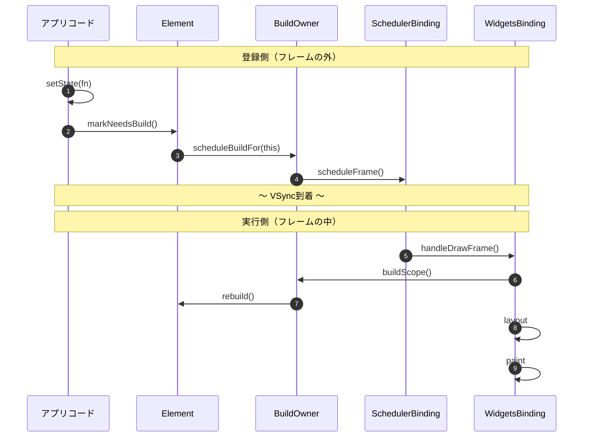

# Chapter 4: 再構築スケジューリング

▶ [検証コード（GitHub）](https://github.com/su3n4g4/flutter-element-lab/tree/main/flutter_element_lab/lib/chapters/ch4)　▶ [検証画面](https://su3n4g4.github.io/flutter-element-lab/)

## この章で確かめること

**setStateを呼んだとき、buildはいつ・誰によって実行されるのか？**

---

## 前提：setStateからbuildまでの間に何が行われているのか

setStateを呼ぶとUIが更新されますが、setStateがbuildを直接呼んでいるわけではありません。間にフレームという単位と、3つの責務があります。この章の検証シナリオを読む前に、まずこの構造を押さえておきます。

### フレーム：画面を1回書き換える単位

スマホの画面は動画と同じ原理で、静止画を高速に描き替えることで動きを表現しています。1秒間に60回（60fps）や120回（120fps）、画面全体を描き直します。この**1回の描き直し**が1フレームとなります。

```
時間 →
│ フレーム1 │ フレーム2 │ フレーム3 │ フレーム4 │
│  16.7ms   │  16.7ms   │  16.7ms   │  16.7ms  │
                                     ↑
                                    60fpsなら1フレーム≒16.7ms
```

ディスプレイのハードウェアが「次の描き直しの準備ができました」と通知する信号でVSyncというものがあります。フレームの開始はVSync信号によって決まるため、アプリコード側からbuildの実行タイミングを制御することはできません。アプリコード側からできるのは、setStateを通じて「このElementは再構築が必要」というフラグ（dirty）をElementに付け、次のフレームでのrebuildを予約することだけとなります。

1フレームの中では、build（Widgetの再生成）→ layout（サイズと位置の計算）→ paint（ピクセルの描画）のまとまりで実行されます。

### なぜ「登録」と「実行」が分かれるのか

仮にsetStateから直接buildを呼ぶとしたら、毎回buildからpaintまでを行うことになります。

```
仮にsetStateが直接buildを呼ぶ場合：
  setState #1 → build → layout → paint  ← 画面描き直し
  setState #2 → build → layout → paint  ← もう一度描き直し
  setState #3 → build → layout → paint  ← さらにもう一度

  → 1タップで画面を3回描き直すので無駄が多い
```

build・layout・paintはコストの高い処理なので、実行回数を減らしたいところです。そのためsetStateの時点では「このElementを再構築してほしい」という登録までにとどめて、フレーム単位でまとめてbuild・layout・paintを行うことで実行回数を減らしています。

```
実際のFlutterの設計：
  setState #1 → dirty登録（markNeedsBuild）
  setState #2 → 無視（すでにdirty）
  setState #3 → 無視（すでにdirty）

  ～ VSync ～

  build → layout → paint  ← 画面描き直しは1回のみ（handleDrawFrame）
```

この「登録」と「実行」の分離を、3つの責務が連携して実現しています。

### 3つの責務

```
SchedulerBinding  … フレームの「いつ」を管理する（時間）
BuildOwner        … 「何を」rebuildするか管理する（対象）
WidgetsBinding    … フレーム内で「どの順で」処理を進めるか管理する（進行）
```

**SchedulerBinding：** VSyncの信号を受け取り、フレーム処理を起動します。BuildOwnerから「次のフレームが必要です」というリクエスト（`scheduleFrame()`）を受け付け、次のVSyncで`handleDrawFrame()`を起動します。フレームの中身（何をbuildするか、どの順で処理するか）には関知しません。

**BuildOwner：** 「登録」と「実行」の両方を担います。登録側では`scheduleBuildFor()`でdirty Elementをリストに収集します。実行側では`buildScope()`でdirtyリストをdepth順にソートし、各Elementの`rebuild()`を実行します。重複排除（同じElementが複数回登録されても1回しかrebuildしない）もここが担います。

**WidgetsBinding：** フレーム内でbuild → layout → paint → finalizeTreeの順序を管理する進行役です。`drawFrame()`の中でBuildOwnerにbuildScopeの実行を指示し、その後にlayout・paintを起動します。

3つの連携を図にするとこうなります。



登録側（フレームの外）で起きたことが、VSync到着を挟んで実行側（フレームの中）で処理されます。この構造をログで確認するのが、この章の検証シナリオの目的となります。

### 検証で確認すること

前提を踏まえた上で、この章では下記を検証していきます。

- **重複排除の確認：** setStateを同一イベント内で3回呼んだとき、buildは本当に1回にまとまるか
- **遅延実行の確認：** 非同期完了後にsetStateを呼んだとき、同じ仕組みで処理されるか
- **depth順ソートの確認：** 親と子がどちらもrebuildされるとき、親が先にbuildされるか


## ログの仕込み方：登録と実行の分離を確認する

ログを仕込んで検証を行うには、次の3つを確認していきます。。

- setStateを起点にElementがdirty登録されたこと
- VSync到着後のフレームでbuild()が開始されたこと
- build・layout・paintを含むフレームの描画処理が完了したこと

実際に1フレームの処理順序の中で、どこに何を仕込んでいるかを下記に示します。

```
1フレームの処理順序と各ログの位置：

_runMultipleSetState()               ← [ACTION]（setStateを呼び出すイベントハンドラのdebugPrint）
    ～ VSync到着 ～
handleDrawFrame()
  ├→ drawFrame()
  │    ├→ buildScope()               ← [BUILD] が出る（build()内のdebugPrint）
  │    ├→ layout処理
  │    └→ paint処理
  └→ フレーム完了後コールバック      ← [FRAME] が出る（addPostFrameCallback内のdebugPrint）
```

**[ACTION]：イベントハンドラ内のdebugPrint**

```dart
void _runMultipleSetState() {
  debugPrint('[ACTION] call setState x3 in one tap');
  setState(() => syncActionCount += 1);
  // ...
}
```

setStateを呼ぶ直前にログが表示されます。フレームの外の出来事です。

**[BUILD]：build()メソッド内のdebugPrint**

```dart
@override
Widget build(BuildContext context) {
  debugPrint('[BUILD] parent page');
  // ...
}
```

BuildOwnerがbuildScope内でrebuildを実行すると、build()が呼ばれてログが表示されます。フレームの中の出来事です。

**[FRAME]：addPostFrameCallback**

```dart
void _scheduleFrameProbe() {
  SchedulerBinding.instance.addPostFrameCallback((_) {
    if (!mounted) return;
    frameCount += 1;
    debugPrint('[FRAME] drawFrame completed: #$frameCount');
    _scheduleFrameProbe(); // 1回限りなので再登録が必要
  });
}
```

`drawFrame()`の完了後に呼ばれます。フレーム完了の打刻です。`addPostFrameCallback`は1回限りのコールバックなので、毎フレーム監視するにはコールバック内で自分自身を再登録します。

この3つの出力順序（`[ACTION]` → `[BUILD]` → `[FRAME]`）から、登録と実行の分離が実際に起きていることをログで証明できます。

---

## 重複排除の確認

まずは重複排除の検証から行います。

### 同一イベントでsetStateを3回呼ぶ

**① 初期表示**

画面を開きます。親ページと子StateTracker 2つが表示されます。

```
[BUILD] parent page
initState: child-A  state=241736925
build: child-A  state=241736925  depth=180  widgetType=StateTracker  element=StatefulElement
initState: child-B  state=433407290
build: child-B  state=433407290  depth=180  widgetType=StateTracker  element=StatefulElement
[FRAME] drawFrame completed: #N
```

`[BUILD]`の後に`[FRAME]`が出ています。buildはフレーム完了前に実行されています。

**② 「同一イベントでsetState を3回呼ぶ」ボタン押下**

ボタンを押します。syncActionCountが0から3に変わります。

```
[FRAME] drawFrame completed: #67
[ACTION] call setState x3 in one tap
[BUILD] parent page
didUpdateWidget: child-A -> child-A  state=241736925
build: child-A  state=241736925  depth=180  widgetType=StateTracker  element=StatefulElement
didUpdateWidget: child-B -> child-B  state=433407290
build: child-B  state=433407290  depth=180  widgetType=StateTracker  element=StatefulElement
[FRAME] drawFrame completed: #68
```

setStateを3回呼んだのに、`[BUILD] parent page`は1回しか出ていません。

ログの時系列を整理します。

| 順序 | ログ | タイミング |
| --- | --- | --- |
| 1 | `[FRAME] drawFrame completed: #67` | フレーム完了（ボタン押下前） |
| 2 | `[ACTION] call setState x3` | フレームの外（イベントハンドラ） |
| 3 | `[BUILD] parent page` × 1 | フレームの中（buildScope内） |
| 4 | `build: child-A` | フレームの中（buildScope内） |
| 5 | `build: child-B` | フレームの中（buildScope内） |
| 6 | `[FRAME] drawFrame completed: #68` | フレーム完了 |

`[ACTION]`が`[FRAME] #67`と`[FRAME] #68`の**間**に出ています。これがフレームの外であることの直接的な証拠です。`[BUILD]`は`[ACTION]`の後、次のフレーム（#68）の完了前に実行されています。

**③ もう一度ボタン押下**

もう一度押します。syncActionCountが3から6に変わります。

```
[FRAME] drawFrame completed: #N
[ACTION] call setState x3 in one tap
[BUILD] parent page
didUpdateWidget: child-A -> child-A  state=241736925
build: child-A  state=241736925  depth=180  widgetType=StateTracker  element=StatefulElement
didUpdateWidget: child-B -> child-B  state=433407290
build: child-B  state=433407290  depth=180  widgetType=StateTracker  element=StatefulElement
[FRAME] drawFrame completed: #N+1
```

②と同じパターンです。setStateの回数に関係なく、buildは常にフレームあたり1回です。

### 確認できたこと

setStateはbuildを直接呼びません。setStateが行うのは`Element.markNeedsBuild`を通じてdirtyフラグを立て、`BuildOwner.scheduleBuildFor`に登録することです。実際のbuildは`WidgetsBinding.drawFrame`の中で`BuildOwner.buildScope`が一括実行します。

重複排除の仕組みはmarkNeedsBuildの実装から確認ができます。

```dart
// Element.markNeedsBuild()（assert・デバッグコードを省略）
void markNeedsBuild() {
  // active以外（inactive等）なら何もしない
  if (_lifecycleState != _ElementLifecycle.active) {
    return;
  }
  if (dirty) {
    return;                          // すでにdirtyなら何もしない（重複排除）
  }
  _dirty = true;                     // dirtyフラグを立てる
  owner!.scheduleBuildFor(this);     // BuildOwnerのdirtyリストに登録
}
```

`if (dirty) return;`により、setStateを何回呼んでもdirtyリストへの登録は1回だけになります。1回目のsetStateで`_dirty = true`になった後、2回目・3回目はdirtyチェックでreturnします。

ライフサイクルガードにより、ツリーに接続中（active）のElementだけが先に進めます。Chapter 2で確認した「ツリーから外れたElement」はここで弾かれます。

---

## 遅延実行の確認

重複排除の確認ではタップハンドラ内（同期的）でsetStateを呼びました。では、Future完了後やタイマーコールバックなど、非同期のタイミングでsetStateを呼んだ場合はどうでしょうか。
前提で見た「登録と実行の分離」が同期・非同期に依存しないことを確認します。

### 非同期完了後にsetStateを呼ぶ

**① 「非同期完了後に setState を呼ぶ」ボタン押下**

ボタンを押します。350ms後にasyncActionCountが0から1に変わります。

```
[ACTION] async started
[FRAME] drawFrame completed: #N+3
[FRAME] drawFrame completed: #N+4
...（350msの間、約21フレーム続く）
[FRAME] drawFrame completed: #N+24
[ACTION] async completed -> setState
[BUILD] parent page
didUpdateWidget: child-A -> child-A  state=241736925
build: child-A  state=241736925  depth=180  widgetType=StateTracker  element=StatefulElement
didUpdateWidget: child-B -> child-B  state=433407290
build: child-B  state=433407290  depth=180  widgetType=StateTracker  element=StatefulElement
[FRAME] drawFrame completed: #N+25
```

`[ACTION] async started`の後、350msの待機中に約21フレーム分の`[FRAME]`が出続けていますが、その間`[BUILD]`は一度も出ていません。dirty Elementがないフレームではbuildが走りません。60fpsで350ms待つと約21フレーム（350 ÷ 16.7 ≈ 21）になるため、実測値と一致します。

async完了後はsetStateが呼ばれ、次のフレームでbuildが実行されています。

待機中フレームと完了後フレームを比較します。

| フレーム | dirty Element | buildの実行 |
| --- | --- | --- |
| #N+3〜#N+24（待機中） | なし（setStateはまだ呼ばれていない） | `[BUILD]`が出ない（早期リターン） |
| #N+25（完了後） | あり（async完了後にsetStateで登録） | `[BUILD] parent page`が出る |

### 確認できたこと

非同期完了後のsetStateも、同期版と全く同じメカニズムで処理されます。呼び出しのタイミングが違うだけで、dirty登録→次フレームでBuildOwnerがrebuildという流れは変わりません。

待機中の約21フレームにわたって`[BUILD]`が出ないことは、dirty Elementがないフレームではbuildが走らないことを示しています。これはBuildOwnerの`buildScope()`が、dirtyリストが空の場合に早期リターンする設計によるものです。

```dart
// BuildOwner.buildScope()（assert・デバッグコードを省略）
void buildScope(Element context, [VoidCallback? callback]) {
  final BuildScope buildScope = context.buildScope;

  if (callback == null && buildScope._dirtyElements.isEmpty) {
    return;                          // dirtyリストが空なら何もしない
  }

  try {
    buildScope._building = true;
    buildScope._flushDirtyElements(debugBuildRoot: context);
    // ↑ dirtyリストをdepth順にソートし、各Elementをrebuild
  } finally {
    buildScope._building = false;
  }
}
```

処理の流れと実際のログを照らし合わせます。

| 実行処理 | 実際のログ |
| --- | --- |
| `setState(fn)` → `fn()` | `[ACTION] async completed -> setState` |
| `markNeedsBuild()` → `scheduleBuildFor(this)` | （内部処理、ログなし） |
| ～ VSync到着 ～ drawFrame開始 ～ | （ログなし） |
| `buildScope()` → `rebuild()` | `[BUILD] parent page` |
| drawFrame完了 | `[FRAME] drawFrame completed: #N+25` |

---

### この検証からわかること

重複排除と実行遅延の検証で確認できたのは、前提で説明した構造がそのまま動いているということです。setStateはdirtyマークを付けてBuildOwnerに「このElementを次のフレームで再構築してほしい」と依頼するだけです。buildの実際の実行はBuildOwnerがフレーム描画のパイプラインの中で一括処理します。同期・非同期、1回・3回に関わらず、この構造は変わりません。

---

## depth順ソートの確認

重複排除の検証でbuildが「フレームあたり1回」にまとまることを確認しました。では、親と子がどちらもrebuildされるとき、どちらが先にbuildされるのでしょうか。

### 親→子のrebuild順序

基本のシナリオ②のログをもう一度見ます。

```
[FRAME] drawFrame completed: #67
[ACTION] call setState x3 in one tap
[BUILD] parent page
didUpdateWidget: child-A -> child-A  state=241736925
build: child-A  state=241736925  depth=180  widgetType=StateTracker  element=StatefulElement
didUpdateWidget: child-B -> child-B  state=433407290
build: child-B  state=433407290  depth=180  widgetType=StateTracker  element=StatefulElement
[FRAME] drawFrame completed: #68
```

ここで注意すべき点が2つあります。

**親が先、子が後：** `[BUILD] parent page`が最初に出て、その後にchild-A・child-Bが続きます。これはBuildOwnerの`_flushDirtyElements()`がdirtyリストをdepth順にソートしてrebuildを実行するためです。depthが浅い親が先にrebuildされ、深い子が後になります。

**child-AとChild-Bのdepthは同じ：** child-Aとchild-BはColumnの子として同じ階層にいる兄弟（siblings）なので、depthは同じ値になります。ログのdepth=180が同じ値であることがそれを示しています。兄弟間のrebuild順序はdepth順ソートでは決まらず、Columnのchildrenリストの走査順に従います。

```
親ページ (StatefulWidget)       ← depth 浅い → 先にrebuild
  └→ Column
       ├→ StateTracker('child-A')  ← depth 深い（兄弟同士は同じdepth）
       ├→ SizedBox
       └→ StateTracker('child-B')  ← depth 深い（child-Aと同じ）
```

**なぜ親が先なのか：** 親のbuildが先に実行されることで、子に渡すWidgetが確定します。もし子が先にbuildされると、親のbuildで子のWidgetが差し替わった場合に二度手間になります。depth順にすることで、不要なrebuildを避けています。

**なぜ子もrebuildされるのか：** このシナリオでは、setStateを呼んだのは親ページだけです。子のStateTracker自身はdirtyマークされていません。しかし、親のbuildが実行された結果、子に対してupdateChildが走り、子のbuildも実行されます。

**確認できたこと：** BuildOwnerはdirty Elementをツリーの深さ順（親→子）でrebuildします。この順序により、親のbuild結果を子に反映してから子を処理するという効率的なパイプラインが実現されています。

---

## 検証結果まとめ

| シナリオ | 確認できたこと |
| --- | --- |
| 重複排除 | setStateを同一イベントで3回呼んでもbuildは1回だけ実行される。markNeedsBuildの`if (dirty) return`による重複排除が機能している |
| 実行遅延 | 呼び出しタイミング（同期・非同期）に関わらず、dirty登録 → 次フレームでBuildOwnerがrebuildという経路は変わらない。待機中フレームではdirtyリストが空なのでbuildは走らない |
| depth順ソート| BuildOwnerはdirty Elementをツリーの深さ順（depth順）でrebuildする。親が先にbuildされ、子が後になる |

---

## 実装時に気をつけること

- setStateを何回呼んでもbuildはフレームあたり1回にまとまるため、setState呼び出しの回数自体はパフォーマンス上の問題になりません。問題になるのはbuildが走るWidgetの範囲（スコープ）です。setStateを呼ぶStatefulWidgetがツリーの上位にあるほど、rebuildされる子孫の数が増えます。
- 非同期完了後のsetStateでは、呼び出し前に`mounted`チェックが必要です。Futureの完了を待っている間にElementがツリーから外れている（Chapter 2で確認したdispose）可能性があります。前提で見たmarkNeedsBuildのライフサイクルガードがこの安全弁ですが、`mounted`チェックはそれ以前にアプリコード側で行うべき慣習です。
- rebuildの順序は開発者が制御するものではなく、BuildOwnerがdepth順で自動的に決定します。特定の順序に依存するコードを書くと、ツリー構造の変更で予期しない動作を招きます。
