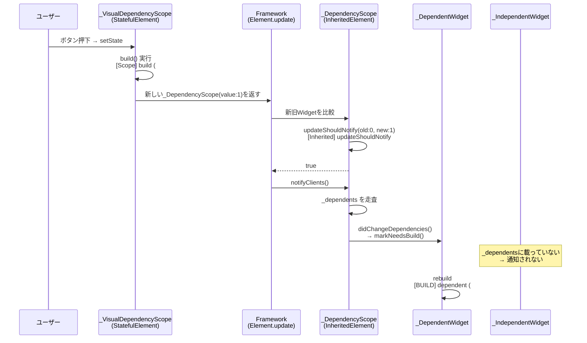
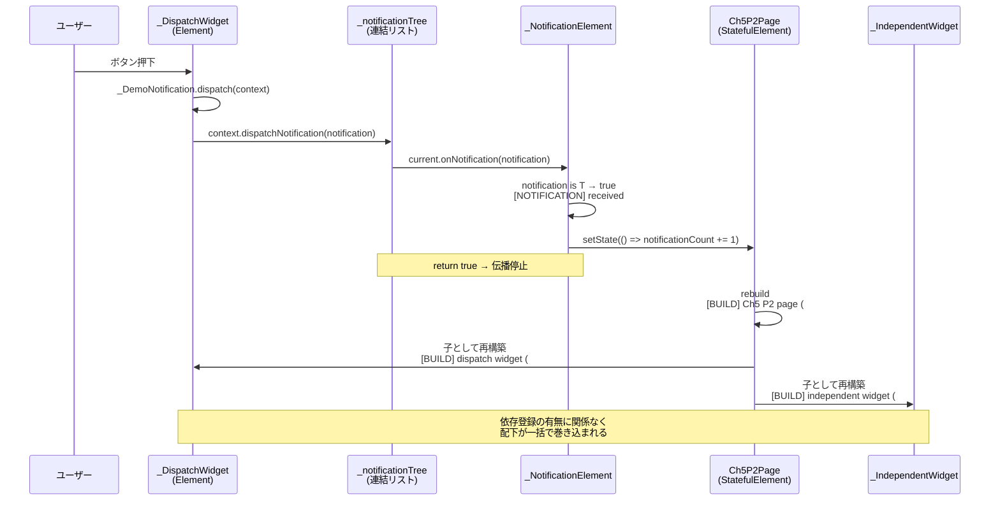

# Ch5: 依存と通知の管理

## 章の中心的な問い

**ツリー内で離れた場所にあるWidget同士は、どのように値を共有し、どの範囲までrebuildが届くのか？**

---

## 前提：InheritedWidgetとNotificationは何をしているのか

`setState`はElement自身を再構築するための仕組みだった（Ch4）。しかし実アプリでは、自分自身ではなくツリーの離れた場所にあるWidgetに変更を届けたい場面がある。親が持つテーマ色を深い子孫で使いたい、子孫でのイベントを親に知らせたい、といった要求である。

Flutterはこれを2つの仕組みで解く。

- **InheritedWidget**：親から子孫への「下方向」の値の供給
- **Notification**：子孫から親への「上方向」のイベントの伝播

両者は方向が逆なだけでなく、**通知先がどう決まるか**が根本的に異なる。InheritedWidgetは「`of()`を呼んだElementだけに通知が届く」という動的な依存登録を持つのに対し、Notificationは「ツリー上にあるListenerが順番に受け取る」という静的な構造解決しか持たない。この違いを理解するために、まず両者がmount時とbuild時にそれぞれ何を構築しているかを押さえておく。

### Elementは2系統の補助構造を保持する

mountされた各Elementは、Widget本体のツリー（親子関係）とは別に、2系統の補助構造を保持している。

- **`_inheritedWidgets`**：祖先のInheritedElementを型で引くためのマップ
- **`_notificationTree`**：祖先の`NotificationListener`を辿るための連結リスト

どちらもmountのタイミングで親から引き継いで構築される。違いは「自分自身がそこに登場するかどうか」であり、これがそのまま2つの経路の性格を決めている。

### InheritedWidget：祖先索引（mount時）と依存登録（build時）の二段構え

InheritedWidgetは「スコープの公開」と「差分判定」を担う。この経路には**異なるタイミングで作られる2つの構造**が関わっている。

**段階1：祖先の索引化（mount時）**

Elementがmountされる際、`_updateInheritance`が呼ばれて親から`_inheritedWidgets`マップ（Type → InheritedElement）をコピーする。InheritedElement自身は、このマップに自分を加えてから子に渡す。これによって任意のElementから「自分の祖先にあるInheritedWidget」をO(1)で型引きできるようになる。

```dart
// Element._updateInheritance()
void _updateInheritance() {
  _inheritedElements = _parent?._inheritedElements;
}

// InheritedElement._updateInheritance()（オーバーライド）
@override
void _updateInheritance() {
  assert(_lifecycleState == _ElementLifecycle.active);
  final PersistentHashMap<Type, InheritedElement> incomingWidgets =
      _parent?._inheritedElements ?? const PersistentHashMap<Type, InheritedElement>.empty();
  _inheritedElements = incomingWidgets.put(widget.runtimeType, this);
}
```

ここで構築されるのは「祖先を引くための索引」であって、「rebuild対象としての登録」ではない。

**段階2：依存登録（build時）**

実際に「このInheritedWidgetが更新されたらrebuildされる側」として登録されるのは、`build()`内で`dependOnInheritedWidgetOfExactType<T>()`が呼ばれた瞬間である。段階1で作った`_inheritedWidgets`マップから祖先のInheritedElementを引き、その`_dependents`に自分自身を追加する。

```dart
// Element.dependOnInheritedWidgetOfExactType<T>()
@override
T? dependOnInheritedWidgetOfExactType<T extends InheritedWidget>({Object? aspect}) {
  assert(_debugCheckStateIsActiveForAncestorLookup());
  final InheritedElement? ancestor = _inheritedElements?[T];  // ← 段階1の索引を使う
  if (ancestor != null) {
    return dependOnInheritedElement(ancestor, aspect: aspect) as T;
  }
  _hadUnsatisfiedDependencies = true;
  return null;
}

// Element.dependOnInheritedElement()
@override
InheritedWidget dependOnInheritedElement(InheritedElement ancestor, { Object? aspect }) {
  _dependencies ??= HashSet<InheritedElement>();
  _dependencies!.add(ancestor);
  ancestor.updateDependencies(this, aspect);  // ← ここで_dependentsに登録（段階2）
  return ancestor.widget as InheritedWidget;
}
```

`ancestor.updateDependencies(this, aspect)`で、呼び出し元のElement（`this`）がInheritedElementの`_dependents`に追加される。重要なのは、この登録はWidget定義時でもmount時でもなく、**`build()`内で`dependOn`が呼ばれた時点**でしか起きないということ。同じElementでも、build内で`of()`を呼んだフレームでは`_dependents`に載るが、条件分岐で呼ばなかったフレームでは依存を失う。**どのElementが通知を受け取るかはWidgetの静的な構造からは決まらず、build()の実行履歴によって決まる。**

更新時の通知経路は次のとおり。

```dart
@override
void notifyClients(InheritedWidget oldWidget) {
  assert(_debugCheckOwnerBuildTargetExists('notifyClients'));
  for (final Element dependent in _dependents.keys) {
    assert(() {
      // check that it really is our descendant
      Element? ancestor = dependent._parent;
      while (ancestor != this && ancestor != null) {
        ancestor = ancestor._parent;
      }
      return ancestor == this;
    }());
    // check that it really depends on us
    assert(dependent._dependencies!.contains(this));
    notifyDependent(oldWidget, dependent);  // 内部でdependent.didChangeDependencies() → markNeedsBuild()
  }
}
```

`_dependents.keys`を走査して、登録済みElementにのみ`markNeedsBuild`を流す。ここに載っていないElementは、`updateShouldNotify`が`true`を返しても何も起きない。

### Notification：構造解決のみ（mount時）、依存登録なし

一方、Notification経路にはInheritedWidgetでいう段階2に相当する「rebuild対象としての依存登録」がない。代わりにmount時に作られるのが`_notificationTree`である。

**mount時：Listenerだけが連結された別系統のリンク**

すべてのElementは`attachNotificationTree()`というフックを持ち、`mount`のタイミングで呼ばれる。通常のElementは親の`_notificationTree`参照をそのまま受け継ぐだけだが、`NotifiableElementMixin`をミックスインしたElement（`NotificationListener`が使う）は、自分自身を含む新しいノードを作って親から引き継いだ伝播経路の先頭に追加する。

```dart
// NotifiableElementMixin
void attachNotificationTree() {
  _notificationTree = _NotificationNode(_parent?._notificationTree, this);
  // ↑ 自分を _NotificationNode に包み、親の _notificationTree を後ろに連結
}
```

連結リストのprependに相当する操作で、結果としてツリー構築と並行して**Listenerだけが連結された連結リスト**が出来上がる。子のElementは親の`_notificationTree`を参照として受け継ぐため、任意の子Elementから`dispatch`を呼べば、その時点で保持している`_notificationTree`を通じて祖先のListenerへ到達できる。

**dispatch時：3層に分かれた処理**

`Notification.dispatch(context)`は、すでに出来上がっている`_notificationTree`チェーンを辿って近い順にListenerに通知する。実装は3つのクラスに責務が分かれている。

```dart
// Notification.dispatch
void dispatch(BuildContext? target) {
  target?.dispatchNotification(this);
}

// NotifiableElementMixin.dispatchNotification
@override
void dispatchNotification(Notification notification) {
  _notificationTree?.dispatchNotification(notification);
}

// _NotificationNode.dispatchNotification
void dispatchNotification(Notification notification) {
  if (current?.onNotification(notification) ?? true) {
    return;  // true → 伝播停止
  }
  parent?.dispatchNotification(notification);  // false → 上位ノードへ続く
}
```

`Notification`自体はデータの運搬役に徹し、伝播ロジックは持たない。`context.dispatchNotification`がmount時に構築済みの`_notificationTree`を起点に走査を始め、各ノードの`current`（`_NotificationElement`）が`onNotification`を返す。戻り値が`true`なら伝播停止、`false`なら`parent`（連結リストの次ノード）へ進む。型フィルタリング（`notification is T`）は`_NotificationElement.onNotification`内で行われるため、型が一致しないListenerは`false`を返してスルーされる。

ここで重要なのは、**通知の宛先がツリー構造（mount時に決まる静的な配置）から完全に決まっていて、build()内で何を呼ぼうと宛先は変わらない**ということ。InheritedWidgetが`of()`を呼んだElementを動的に`_dependents`へ登録するのとは対照的に、Notificationは「誰が通知を受け取るか」を構造そのもので固定している。

そして、Notificationそれ自体はrebuildを起こさない。rebuildが起きるかどうかは、Listenerが`onNotification`コールバックの中で`setState`を呼ぶかどうかに依存する。呼べば通常のsetStateと同じ経路（Ch4）でrebuildが起き、呼ばなければ何も起きない。

### 2つの経路の対比

ここまでの整理をまとめる。

| 観点 | InheritedWidget | Notification |
| --- | --- | --- |
| mount時に作られる構造 | `_inheritedWidgets`（祖先の型索引） | `_notificationTree`（Listenerの連結リスト） |
| 「rebuild対象」としての登録 | あり（build時に`_dependents`へ追加） | なし |
| 通知先の決まり方 | build()の実行履歴で動的に決まる | ツリー構造で静的に決まる |
| 通知それ自体がrebuildを起こすか | はい（`markNeedsBuild`を直接呼ぶ） | いいえ（`setState`を呼ぶかは捕捉側次第） |

InheritedWidgetは`_dependents`という索引を持つことで、Widgetツリーの親子関係とは独立して通知先を絞れる。対してNotificationは依存登録機構を持たず、rebuildの範囲は捕捉側が`setState`を呼ぶかどうか・どのElementで呼ぶかだけで決まる。

### ログの仕込み方

ここまでで、2つの仕組みの違いが分かった。

- InheritedWidgetは`_dependents`という索引で通知先を絞り、登録は`build()`内で`dependOn`が呼ばれた時点で起きる
- Notificationは依存登録機構を持たず、宛先はmount時に決まる`_notificationTree`の構造で固定される
- rebuildを起こすかどうかも、前者は索引経由で自動、後者は捕捉側の`setState`次第

これを観測するには、「誰が、いつ、何回rebuildされたか」を全Widgetに仕込めばよい。ただし観測したい主張は2つの仕組みで別物なので、ログも仕組みごとに分けて設計する。

### InheritedWidget用：依存登録の有無がrebuildを分けることを観測する

InheritedWidget側で確かめたいのは「`of()`を呼んだElementだけがrebuildされる」という選択性である。これを観測するには、build回数の差と、`_dependents`への通知が走る直前の差分判定タイミングを両方押さえる必要がある。

**[BUILD]：build()内のdebugPrint（dependent/independent両方に仕込む）**

```dart
@override
Widget build(BuildContext context) {
  buildCount += 1;
  final value = _DependencyScope.of(context).value;
  debugPrint('[BUILD] dependent (#$buildCount) value=$value');
  // ...
}
```

dependent側だけでなくindependent側にも同じ形で仕込む（`of()`は呼ばない）。両者のbuildカウントを並べて見ることで、依存登録があるElementだけがrebuildされる選択性が直接ログに表れる。

**[Inherited]：updateShouldNotify内のdebugPrint**

```dart
@override
bool updateShouldNotify(_DependencyScope oldWidget) {
  debugPrint('[Inherited] updateShouldNotify old=${oldWidget.value} new=$value');
  return value != oldWidget.value;
}
```

差分判定が呼ばれたタイミングと新旧値を記録する。`_dependents`への通知が起きる直前の関門であり、ここで`false`が返れば通知自体が起きない。「親はrebuildされた、子の`updateShouldNotify`は呼ばれた、それでもindependentは沈黙した」という3段階の事実が並ぶことで、選択性の根拠が`_dependents`にあることが言える。

**期待される出力パターン**

```
[Scope] build (#N) value=Y                     ← 値を保持する側のrebuild（setState起点）
[Inherited] updateShouldNotify old=X new=Y     ← 差分判定（trueで通知が走る）
[BUILD] dependent (#N) value=V                 ← 登録済みElementだけrebuild
（[BUILD] independentは出ない）                ← 未登録Elementは沈黙
```

この出力が得られれば、`updateShouldNotify`が`true`を返したのにindependentが反応しないという事実から、「通知先は依存登録の有無で決まる」「`_dependents`未登録のElementには通知が届かない」という主張がログだけで証明できる。

### Notification用：rebuild範囲が捕捉側に委ねられることを観測する

Notification側で確かめたいのは、InheritedWidgetとは正反対の主張である：**選択的rebuildのような索引が存在せず、`onNotification`内で`setState`を呼んだ瞬間に捕捉側Element以下が一括でrebuildに巻き込まれる**こと。これを観測するには、通知の到達と、そこから始まる通常のrebuildパスが捕捉側Element配下を一括で巻き込む様子を押さえる。

**[NOTIFICATION]：onNotificationコールバック内のdebugPrint**

```dart
onNotification: (notification) {
  debugPrint('[NOTIFICATION] received: ${notification.message}');
  setState(() => notificationCount += 1);
  return true;
},
```

Notificationが`_notificationTree`チェーンを辿ってListenerに届いた瞬間と、そこから`setState`が呼ばれる瞬間を記録する。

**[BUILD]：捕捉側ページと配下Widget全部に仕込む**

InheritedWidget側と同じ`[BUILD]`ログを、捕捉側ページ・dispatch元のleaf・dispatchに関与しないindependentすべてに仕込む。Notification経由では`onNotification`内の`setState`が通常のrebuildパス（Ch4）を起動するため、ページ以下が依存の有無に関係なく全部rebuildされる。これがログでも全Widgetがカウントアップする形で見える。

**期待される出力パターン**

```
[NOTIFICATION] received: leaf -> bubble        ← _notificationTreeを辿って捕捉
[BUILD] page (#N)                              ← setState起点の通常rebuildパス
[BUILD] dispatch widget (#N)                 ← 配下なので巻き込まれる
[BUILD] independent widget (#N)                ← 依存していなくても巻き込まれる
```

この出力が得られれば、「Notification自体はrebuildを起こさず、捕捉側`setState`が通常のrebuildパスを起動する」「依存登録機構を持たないので範囲は絞れない」という主張がログだけで言える。InheritedWidget側でindependentが沈黙したのと対比すれば、両者の挙動の差が依存登録機構の有無に帰着することも明確になる。

### この章で確認すること

前提を踏まえると、この章の検証シナリオが何を確認しようとしているかが分かる。

- **依存登録による選択的rebuildの確認**：InheritedWidgetの値を更新したとき、`of()`を呼んだ子だけがrebuildされ、呼ばなかった子は沈黙するか（基本）
- **登録機構を持たない経路の確認**：Notificationは`_dependents`のような依存登録を持たず、rebuild範囲は捕捉側の`setState`に委ねられることを示せるか（派生）

---

## 基本：dependOnを呼んだ子だけがrebuildされる

前提で「依存登録による選択的rebuild」の仕組みを見た。ここではそれを実際のログで確認する。

### InheritedWidget配下に「依存あり」「依存なし」の子を並べる

検証画面の構造は次のとおり。値の保持と更新は`_VisualDependencyScope`（StatefulWidget）が担い、その内側で`_DependencyScope`（InheritedWidget）を子に被せる。配下に2種類の子を並べる。

```
_Ch5P1InheritedDependencyPage (Stateless)
  └─ _VisualDependencyScope (Stateful, value=N)
      └─ _DependencyScope (InheritedWidget)
          ├─ _DependentWidget    ← build内でof()を呼ぶ（依存登録あり）
          └─ _IndependentWidget  ← 何も呼ばない（依存登録なし）
```

検証コード（主要部のみ）。

```dart
// 値の管理とInheritedWidgetの可視化を担うラッパー
class _VisualDependencyScopeState extends State<_VisualDependencyScope> {
  int value = 0;
  int buildCount = 0;

  void _increment() {
    setState(() => value += 1);
  }

  @override
  Widget build(BuildContext context) {
    buildCount += 1;
    debugPrint('[Scope] build (#$buildCount) value=$value');
    return WidgetBox(
      kind: WidgetKind.inherited,
      name: '_DependencyScope',
      role: 'value を公開する InheritedWidget。of() でアクセス可',
      badges: ['value: $value', 'updateShouldNotify'],
      buildCount: buildCount,
      child: _DependencyScope(
        value: value,
        child: Column(
          crossAxisAlignment: CrossAxisAlignment.stretch,
          children: [
            const SizedBox(height: 4),
            FilledButton(
              onPressed: _increment,
              child: const Text('value を更新する（_DependentWidget だけ rebuild される）'),
            ),
            const SizedBox(height: 8),
            widget.child,
          ],
        ),
      ),
    );
  }
}

class _DependencyScope extends InheritedWidget {
  const _DependencyScope({required super.child, required this.value});

  final int value;

  static _DependencyScope of(BuildContext context) {
    final scope =
        context.dependOnInheritedWidgetOfExactType<_DependencyScope>();
    assert(scope != null, '_DependencyScope is missing in the widget tree');
    return scope!;
  }

  @override
  bool updateShouldNotify(_DependencyScope oldWidget) {
    debugPrint('[Inherited] updateShouldNotify old=${oldWidget.value} new=$value');
    return value != oldWidget.value;
  }
}

// 依存ありWidget
class _DependentWidgetState extends State<_DependentWidget> {
  int buildCount = 0;

  @override
  Widget build(BuildContext context) {
    buildCount += 1;
    final value = _DependencyScope.of(context).value;  // ← ここで依存登録
    debugPrint('[BUILD] dependent (#$buildCount) value=$value');

    return WidgetBox(
      kind: WidgetKind.stateful,
      name: '_DependentWidget',
      role: 'of() で value を取得する',
      badges: const ['dependOn: ✓'],
      buildCount: buildCount,
      child: Text('value: $value'),
    );
  }
}

// 依存なしWidget
class _IndependentWidgetState extends State<_IndependentWidget> {
  int buildCount = 0;

  @override
  Widget build(BuildContext context) {
    buildCount += 1;
    debugPrint('[BUILD] independent (#$buildCount)');  // ← of()を呼ばない

    return WidgetBox(
      kind: WidgetKind.stateful,
      name: '_IndependentWidget',
      role: 'of() を呼ばない',
      badges: const ['dependOn: ✗'],
      buildCount: buildCount,
      child: const Text('InheritedWidget の更新は届かない'),
    );
  }
}
```

**① 初期表示**

画面を開く。`_VisualDependencyScope`、dependent、independentがすべて初回buildされる。

```
[Scope] build (#1) value=0
[BUILD] dependent (#1) value=0
[BUILD] independent (#1)
```

この時点で起きていることは次のとおり。

- `_DependentWidget`：build内で`_DependencyScope.of(context)`が呼ばれ、`InheritedElement._dependents`に自分自身を登録（前提で見た`dependOnInheritedElement → updateDependencies`の経路）
- `_IndependentWidget`：`of()`を呼ばないので`_dependents`には載らない
- 結果として、`_dependents`には dependent だけが登録された状態になる

**② 「valueを更新」ボタン押下**

ボタンを押す。`_VisualDependencyScope`の`setState`で`value`が0から1に変わる。

```
[Scope] build (#2) value=1
[Inherited] updateShouldNotify old=0 new=1
[BUILD] dependent (#2) value=1
```

`[BUILD] independent`は**出ない**。ここで起きている処理を順を追って見る。



ステップごとに整理すると：

1. **[ログ出力] `[Scope] build (#2) value=1`**：`_VisualDependencyScope`の`setState`起点でbuildが走り、冒頭でdebugPrintが打たれる
2. **[内部処理]**：build()内で新しい`_DependencyScope(value: 1)`が生成される
3. **[内部処理]**：`Element.update`で新旧の`_DependencyScope`を比較
4. **[ログ出力] `[Inherited] updateShouldNotify old=0 new=1`**：差分判定が`true`を返す
5. **[内部処理]**：`notifyClients()`が`_dependents`を走査
6. **[内部処理]**：登録済みElementで`didChangeDependencies` → `markNeedsBuild`
7. **[ログ出力] `[BUILD] dependent (#2) value=1`**：登録済みのdependentだけがrebuild
8. **[沈黙] `[BUILD] independent`は出ない**：`_dependents`に載っていないので通知が届かない

**ログの順序が示す時間差**

`[Scope] build`が先で`[Inherited] updateShouldNotify`が後、という順序は重要なヒントである。これは「buildの冒頭でログが出る → buildが完了して新Widgetが返る → フレームワークが新旧Widgetを比較する過程でupdateShouldNotifyを呼ぶ」という時間差をそのまま表している。差分判定はbuildの内部処理ではなく、build結果を受け取ったフレームワーク側の処理である。

**確認できたこと**

ログが3段階に分かれて出る順序自体が、次の経路を実証している。

```
setState
  → 親build（[Scope] build）
    → updateShouldNotify（[Inherited]）
      → notifyClients
        → 依存ElementだけmarkNeedsBuild
          → dependentのrebuild（[BUILD] dependent）
```

そして`[BUILD] independent`が出ないことで、`_dependents`に登録されたElementだけが通知を受ける仕組みが働いていることが裏付けられる。`of()`を呼んだdependentは登録されており、呼ばなかったindependentは登録されていない。**依存登録の有無が、rebuildの有無を直接決定している。**

---

## 派生：Notificationには登録機構がない

基本では、InheritedWidgetが`_dependents`という独自の索引で通知先を絞ることを確認した。では、同じ「ツリーをまたいだ通信」の仕組みでも、登録機構を持たないNotificationではrebuildの範囲がどう決まるのか。前提で見た「捕捉側の`setState`に依存する」ことをログで確認する。

### 子からdispatchし、親のNotificationListenerで捕捉する

検証画面の構造は次のとおり。`NotificationListener`はbuildCountを観測するために`_VisualNotificationListener`（StatefulWidget）でラップしてある。

```
_Ch5P2NotificationBubblePage (Stateful, notificationCount=N)
  └─ _VisualNotificationListener (Stateful)
      └─ NotificationListener<_DemoNotification>
          ├─ _DispatchWidget    ← ボタン押下でdispatch
          └─ _IndependentWidget           ← 通知には関与しない
```

検証コード（主要部のみ）。

```dart
class _Ch5P2NotificationBubblePageState
    extends State<Ch5P2NotificationBubblePage> {
  int notificationCount = 0;
  int pageBuildCount = 0;

  @override
  Widget build(BuildContext context) {
    pageBuildCount += 1;
    debugPrint('[BUILD] Ch5 P2 page (#$pageBuildCount)');

    return Scaffold(
      appBar: AppBar(title: const Text('Ch5 P2: Notification バブルアップ')),
      body: WidgetBox(
        kind: WidgetKind.stateful,
        name: 'Ch5P2NotificationBubblePage',
        role: 'ページ本体。onNotification で setState する',
        badges: ['notificationCount: $notificationCount'],
        buildCount: pageBuildCount,
        child: _VisualNotificationListener(
          onNotification: (notification) {
            debugPrint('[NOTIFICATION] received: ${notification.message}');
            setState(() => notificationCount += 1);  // ← ここでrebuild起点
            return true;
          },
          child: Column(
            crossAxisAlignment: CrossAxisAlignment.stretch,
            children: const [
              _DispatchWidget(),
              _IndependentWidget(),
            ],
          ),
        ),
      ),
    );
  }
}

// NotificationListener の可視化ラッパー
class _VisualNotificationListenerState
    extends State<_VisualNotificationListener> {
  int buildCount = 0;

  @override
  Widget build(BuildContext context) {
    buildCount += 1;
    return WidgetBox(
      kind: WidgetKind.listener,
      name: '_NotificationListener',
      role: 'バブルアップしてきた通知を捕捉する',
      badges: const ['onNotification'],
      buildCount: buildCount,
      child: NotificationListener<_DemoNotification>(
        onNotification: widget.onNotification,
        child: widget.child,
      ),
    );
  }
}

// dispatchする末端Widget
class _DispatchWidgetState extends State<_DispatchWidget> {
  int buildCount = 0;

  @override
  Widget build(BuildContext context) {
    buildCount += 1;
    debugPrint('[BUILD] dispatch widget (#$buildCount)');

    return WidgetBox(
      kind: WidgetKind.stateful,
      name: '_DispatchWidget',
      role: 'dispatch する',
      badges: const ['dispatch: ✓'],
      buildCount: buildCount,
      child: FilledButton.tonal(
        onPressed: () {
          const _DemoNotification(message: 'leaf -> bubble').dispatch(context);
        },
        child: const Text('Notification.dispatch で親へ通知する'),
      ),
    );
  }
}

// 対照群：通知に関与しないWidget
class _IndependentWidgetState extends State<_IndependentWidget> {
  int buildCount = 0;

  @override
  Widget build(BuildContext context) {
    buildCount += 1;
    debugPrint('[BUILD] independent widget (#$buildCount)');

    return WidgetBox(
      kind: WidgetKind.stateful,
      name: '_IndependentWidget',
      role: 'dispatch しない',
      badges: const ['dispatch: ✗'],
      buildCount: buildCount,
      child: const Text('それでもページ全体の rebuild に巻き込まれる'),
    );
  }
}

class _DemoNotification extends Notification {
  const _DemoNotification({required this.message});
  final String message;
}
```

**① 初期表示**

画面を開く。ページ、leaf、independentがすべて初回buildされる。

```
[BUILD] Ch5 P2 page (#1)
[BUILD] dispatch widget (#1)
[BUILD] independent widget (#1)
```

この時点で起きていることは次のとおり。

- 各Element：mount時に`attachNotificationTree`が呼ばれ、親の`_notificationTree`を引き継ぐ
- `_VisualNotificationListener`配下の`NotificationListener`：`_NotificationNode`を生成して連結リストの先頭に追加
- 結果として、leaf と independent は同じ`_notificationTree`を保持し、その先頭ノードが`NotificationListener`を指している
- ただし、基本と異なり「どのElementが将来rebuildされるか」という依存情報はどこにも持たない

**② ボタン押下（Notification.dispatch）**

末端のボタンを押す。`_DemoNotification`がdispatchされる。

```
[NOTIFICATION] received: leaf -> bubble
[BUILD] Ch5 P2 page (#2)
[BUILD] dispatch widget (#2)
[BUILD] independent widget (#2)
```

`[BUILD] dispatch widget`と`[BUILD] independent widget`の**両方**が`(#2)`にカウントアップする。ここが基本のログとの決定的な違いである。基本ではindependentは沈黙したままだったが、派生ではdispatchに関与しないindependentも巻き込まれている。ここで起きている処理を順を追って見る。



ステップごとに整理すると：

1. **[ユーザー操作]**：ボタン押下で`_DemoNotification.dispatch(context)`が呼ばれる
2. **[内部処理]**：`context.dispatchNotification`が leaf の Element が保持する`_notificationTree`を起点にチェーンを走査
3. **[ログ出力] `[NOTIFICATION] received: leaf -> bubble`**：`_NotificationElement`で型一致を確認、コールバック実行
4. **[コールバック内]**：`setState(() => notificationCount += 1)`で`Ch5P2Page`がdirtyになる
5. **[ログ出力] `[BUILD] Ch5 P2 page (#2)`**：通常のrebuildパス（Ch4）が起動
6. **[ログ出力] `[BUILD] dispatch widget (#2)`**：親rebuildに巻き込まれる
7. **[ログ出力] `[BUILD] independent widget (#2)`**：依存関係に関わらず、親rebuildに巻き込まれる

**通知経路とrebuild経路は別物**

ここで重要な区別がある。`dispatch`→`_notificationTree`チェーンの走査→Listenerで捕捉までは「通知経路」で、Notificationそれ自体は何もrebuildを起こさない。rebuildが始まるのは、捕捉側が`onNotification`内で`setState`を呼んでから先である。つまり次の2経路は完全に分離している。

```
通知経路（Notification側）:
  dispatch → _notificationTree → onNotification

rebuild経路（Ch4の通常setState）:
  setState → markNeedsBuild → 次フレームで親build → 配下を全部rebuild
```

**確認できたこと**

Notification経路にはInheritedWidgetでいう`_dependents`のような選択的な索引が存在しない。捕捉後の`setState`は通常のrebuildパスをそのまま起動するため、捕捉側Element以下のWidgetは依存の有無に関係なく全て巻き込まれる。

independentが`[BUILD]`を出したのは、**Notificationに反応したからではなく**、親の`setState`によって通常のrebuild経路に乗っただけである。ログ上は`[NOTIFICATION] received`と`[BUILD] independent widget`が連続して見えるが、両者の因果関係は「Notification → independent」ではなく「Notification → setState → 親rebuild → 配下全部」という二段構えになっている。**Notification自体には範囲を絞る仕組みがないので、rebuildの広さは捕捉側がどのElementで`setState`を呼ぶかだけで決まる。**

### 基本・派生の解釈

基本と派生を合わせて確認できたのは、「ツリーをまたいだ通信」と一口に言っても、rebuildの範囲を決める仕組みは両者で全く異なるということ。

- InheritedWidgetは`_dependents`という独自の索引を持つので、`of()`を呼んだElementにだけrebuildを届けられる
- Notificationは登録機構を持たないので、rebuild範囲は捕捉側の`setState`が張る通常の経路そのものになる

どちらが優れているかという話ではなく、依存登録の有無が挙動の違いを生んでいる。`of()`を呼ぶたびに依存が登録されるという非対称な構造が、InheritedWidgetだけに「選択的rebuild」を可能にしている。

---

## 設計上の注意点

- InheritedWidgetの`_dependents`による選択的rebuildは、`of()`を呼んだ時点でしか登録されない。`build()`内で条件分岐して`of()`を呼ばなかったフレームがあると、そのElementは依存を失った状態になる。次のbuildで再度`of()`を通らない限り、更新通知は届かない。条件付きで依存を扱いたい場合でも、`of()`は無条件に呼ぶのが安全。
- Notificationはrebuild範囲を絞る仕組みを持たないため、`onNotification`で`setState`を呼ぶとListener以下すべてがrebuild対象になる。細かい範囲だけを更新したいなら、Notificationで親に伝えた後、親側でInheritedWidgetや状態管理パッケージ経由で配信する二段構えが必要になる。
- `updateShouldNotify`は差分判定のためだけに呼ばれる関数であり、副作用を持たせる場所ではない。ここで外部の状態を変更したりログ以上の処理を書いたりすると、フレームワークの内部タイミングに依存した壊れやすいコードになる。新旧の値を比較して`bool`を返すだけに留めるのが安全。